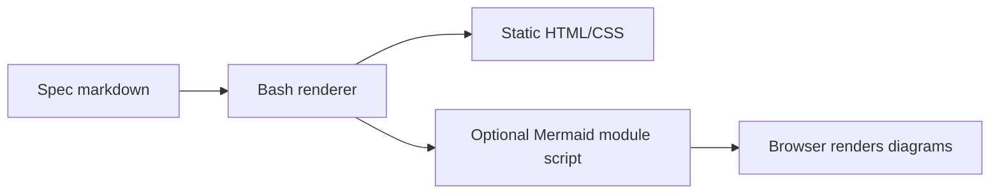

# Bash Spec Renderer
Replace the Python spec renderer with a Bash renderer that emits standalone HTML/CSS and injects Mermaid only when a spec contains Mermaid fences.

## Problem
Devloop is intended to stay dependency-light, but the bundled `devloop-spec` skill currently ships and invokes `skills/devloop-spec/scripts/render.py` for Markdown-to-HTML companion files. That makes Python part of the spec-rendering path, contradicts the desired Bash/HTML/CSS boundary, and forces installer/tests/docs to preserve a non-shell renderer.

## Outcome
The spec companion renderer is implemented in Bash. Rendering a Markdown spec still writes a sibling `.html` file, but no Python file or Python command is required. Specs without Mermaid produce static HTML/CSS only. Specs with `mermaid` fenced code blocks include a browser-side Mermaid v11 module import from jsDelivr so diagrams can render when the HTML is opened with network access.

## Scope
- In: `skills/devloop-spec/scripts/render.py`, a replacement Bash renderer under `skills/devloop-spec/scripts/`, `skills/devloop-spec/SKILL.md`, `README.md`, installer expectations in `scripts/devloop_test.sh`, and renderer fixture coverage in `scripts/devloop_test.sh`.
- In: rendering the devloop spec subset: frontmatter metadata, H1 title, subtitle, `##` sections outside code fences, `###` subheadings, paragraphs, unordered lists, ordered lists, plain code fences, and Mermaid code fences.
- In: native collapsible sections using `
` and `
` so no section-toggle JavaScript is needed.
- Out: adding a generic Markdown parser, vendoring Mermaid, adding npm/node tooling, adding Python, adding a spec format version, or changing the main `devloop` runtime report generation path.

## Behavior
### Happy path
1. A user or agent writes `.devloop/specs/example.md`.
2. The `devloop-spec` skill runs the bundled Bash renderer against that Markdown file.
3. The renderer writes `.devloop/specs/example.html` next to the Markdown source and prints the HTML path.
4. The HTML shows the title, subtitle, metadata, collapsible spec sections, lists, code blocks, and escaped text with the existing light document styling.
5. If the source contains a `mermaid` fenced code block, the HTML contains `<pre class="mermaid">...</pre>` plus the Mermaid v11 module import from `https://cdn.jsdelivr.net/npm/mermaid@11/dist/mermaid.esm.min.mjs`.

### Edge cases
- Markdown file is missing: renderer exits non-zero and prints a concise error to stderr.
- Source contains no Mermaid fences: renderer does not inject any Mermaid script.
- Source contains `##` or `###` inside a fenced code block: renderer treats the text as code, not as a new section or subheading.
- Source contains HTML-sensitive text such as `</pre>`, `<script>`, `&`, or quotes: generated HTML escapes it and does not break the document.
- Source contains unclosed code fences: renderer keeps output valid HTML and renders the remaining content as code.
- Mermaid syntax is invalid: renderer still emits the escaped Mermaid block and module script; fixing Mermaid syntax remains a source Markdown responsibility.

## Acceptance criteria
1. `skills/devloop-spec/scripts/render.py` is removed or no longer installed, and no repository test, README example, or skill instruction invokes `python3 ...render.py`.
2. A Bash renderer exists under `skills/devloop-spec/scripts/`, is executable, accepts exactly one Markdown path argument, writes a sibling `.html`, and prints that path on success.
3. Running the renderer fixture in `scripts/devloop_test.sh` proves that regular specs generate light themed HTML, `##` inside fenced code does not become a section, and HTML-sensitive fenced content is escaped.
4. A renderer fixture containing a `mermaid` fence produces `<pre class="mermaid">` output and injects the Mermaid v11 ESM import exactly once.
5. A renderer fixture without a `mermaid` fence produces no Mermaid script tag.
6. Installed Codex and Claude skill copies contain the Bash renderer and do not contain the removed Python renderer.
7. `bash scripts/devloop_test.sh` passes.

## Test plan
- Red: Update `scripts/devloop_test.sh` to expect a Bash renderer path, no installed `render.py`, conditional Mermaid script injection, fenced-heading safety, and HTML escaping before implementing the renderer.
- Green: `bash scripts/devloop_test.sh`
- Full: `bash scripts/devloop_test.sh`
- Coverage: The Bash project has no separate coverage tool; fixture-style shell assertions in `scripts/devloop_test.sh` are the coverage mechanism for this change.

## Constraints
- Must: keep the local render step dependency-free beyond Bash and standard shell utilities available on macOS/Linux.
- Must: inject the Mermaid module script only when at least one `mermaid` fenced code block is present.
- Must: use this Mermaid import when needed: `https://cdn.jsdelivr.net/npm/mermaid@11/dist/mermaid.esm.min.mjs`.
- Must: keep generated HTML valid and readable if Mermaid cannot load because the browser is offline.
- Avoid: implementing full CommonMark, preserving Python as an optional fallback, introducing Node/npm, or adding generated `.devloop/` runtime artifacts to commits.
- Existing convention: renderer output is a sibling `.html` file beside the Markdown source, and `scripts/devloop_test.sh` owns fixture-style regression coverage.

## Notes
The intended dependency boundary is local Bash generation plus optional browser-side Mermaid CDN for diagram rendering. The renderer should pass Mermaid source through after HTML escaping rather than trying to validate or repair Mermaid syntax. No remaining gaps.
