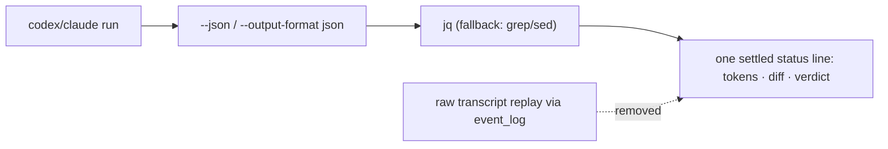

# Streamlined Per-Turn DX
Replace the raw agent-transcript replay with a clean one-line-per-step render driven by structured agent JSON, so each pass shows only what matters: tokens, diff shape, and verdict.

## Problem
Every devloop pass dumps the agent's entire raw transcript to the terminal after each step. The replay loop in `run_with_prompt` (devloop, the `while IFS= read -r line` block near the end of the function) calls `event_log` once per non-empty output line, printing the full diff the agent wrote, plus noise like `hook: Stop`, `hook: Stop Completed`, and `tokens used` / `600,446`. The result is hundreds of indented lines per step where the operator wanted a status. Token usage is buried inside that dump as unlabeled prose rather than a clear per-step metric. The full output is already copied to a per-step log file in the same function, so the on-screen replay adds noise with no durable value.

## Outcome
Each step renders as a single settled status line. While a step runs, only the existing spinner shows (no transcript). When it finishes, the line carries the signal for that step: the coder line shows tokens and diff shape (`N files +X -Y`), the reviewer line shows tokens and the verdict, and the run ends with a token + duration rollup. The complete agent output remains available in `.devloop/logs/<slug>-r<pass>-<role>.log`. Token counts are exact, parsed from the agents' structured JSON output rather than scraped from prose. Output stays clean in both TUI and `--plain` modes.

## Scope
- In: `devloop` functions `run_with_prompt`, `run_agent_once`, `run_codex`, `run_claude`, `extract_session_id`, `event_log`, `event_done`, `event_gate`, and the coder/reviewer steps in the main pass loop (`run_devloop`).
- In: a new JSON extraction helper (tokens, final agent message, session/thread id) that uses `jq` when present and a `grep`/`sed` fallback otherwise.
- In: a diff-shape rollup (`git diff --numstat`) surfaced on the coder step using paths already known to `commit_pass`.
- In: fixture coverage in `scripts/devloop_test.sh` and any `README.md` output examples that change.
- Out: adding a hard `jq` dependency; changing the report-synthesis content; changing acceptance/verdict logic; adding live token streaming (the spinner already covers in-progress state); parsing a richer "N passed" test count from the verify hook (the hook owns `VERIFY_DETAIL`).

## Behavior
### Happy path
1. The coder step starts; only the spinner is visible during the run.
2. The agent is invoked with structured JSON output (`codex exec --json`, `claude -p --output-format json`).
3. On completion the raw transcript is written to the per-step log file but is not replayed to the terminal.
4. The helper parses total tokens and the final agent message from the JSON; the coder step settles to one line: `[ok] implement  codex  MM:SS  <tokens> tok  N files +X -Y`.
5. The reviewer step settles to one verdict-badged line: `[ok] review  claude  MM:SS  <tokens> tok  ACCEPT` or `[rej] ... REJECT · K findings`, with an optional single `└` sub-line pointing at the review file.
6. The run ends with a rollup line: total tokens and elapsed.

### Edge cases
- `jq` absent: fall back to `grep`/`sed` extraction; if that yields nothing, omit the token metric and never fail the run over it.
- Agent emits malformed or partial JSON (crashes mid-run): the step still reports its exit status via `event_done`; missing metrics are omitted, full output is still in the log.
- codex session resume: the resume id is read from the `thread.started` event's `thread_id` instead of grepping a UUID from prose.
- claude session id: `run_claude` still self-generates `--session-id`, so the JSON switch must not change how that id is captured or persisted.
- Non-TTY / piped output (`--plain` or no tty): one line per step, no spinner frames, no transcript replay.
- Final agent message is multi-line: the status line stays compact; full text remains in the log only.
- Downstream consumers of `RUN_OUTPUT` (notably `extract_session_id`) must read the JSON form correctly and must not feed raw JSON into report synthesis.

## Acceptance criteria
1. A devloop run (TUI mode) over a stubbed agent produces zero replayed transcript lines for a step; the per-step output is the spinner during the run plus one settled status line after.
2. The complete agent output is still written to `.devloop/logs/<slug>-r<pass>-<role>.log` for every step.
3. `run_codex`/`run_claude` invoke their agents with JSON output (`--json` for codex, `--output-format json` for claude) and runs still complete with the same exit-status semantics as today.
4. The coder step's settled line includes a token count (when parseable) and a `N files +X -Y` diff shape derived from the committed paths.
5. The reviewer step renders as a single verdict-badged line (`ACCEPT`/`REJECT`/`UNCLEAR`), replacing the separate `event_done` + `event_gate` pair, with at most one `└` sub-line referencing the review file.
6. With `jq` masked from `PATH`, the run still succeeds: token metrics come from the fallback extractor or are omitted, and no step errors solely because `jq` is missing.
7. codex session resume continues to work using the `thread.started.thread_id` value from JSON output (verified by a resumed-pass fixture).
8. `bash scripts/devloop_test.sh` passes.

## Test plan
- Red: add fixtures to `scripts/devloop_test.sh` that stub codex/claude to emit captured JSON (see Notes for real shapes) and assert (a) no transcript lines in step output, (b) token metric present on the settled line, (c) session/thread id captured, (d) a `jq`-masked run still succeeds with graceful degradation. Add these before implementing.
- Green: `bash scripts/devloop_test.sh` (targeted to the new render/parse fixtures).
- Full: `bash scripts/devloop_test.sh`.
- Coverage: the Bash project has no separate coverage tool; fixture-style shell assertions in `scripts/devloop_test.sh` are the coverage mechanism for this change.

## Constraints
- Must: keep the full agent output in per-step log files; the on-screen change must not lose any data.
- Must: preserve the existing `event_step`/`event_done`/`event_gate` status-line model and `[ok]`/`[run]`/`[warn]`/`[fail]` badge style (add a verdict badge for the reviewer line; pad badge width so `[warn]` does not shift the column).
- Avoid: introducing a hard `jq` dependency (the project is intentionally dependency-light; today only `gh --jq`, gh's built-in, is used). Use `jq` opportunistically with a pure-shell fallback.
- Avoid: live token/JSON streaming to the terminal; the spinner already covers in-progress state.
- Existing convention: portable macOS/Linux shell, small named functions, quoted expansions, fixture-style tests asserting user-visible output.

## Notes
Validated agent JSON shapes (captured live this session against the installed CLIs):

- codex `codex exec --json` (JSONL): `turn.completed.usage` = `{input_tokens, cached_input_tokens, output_tokens, reasoning_output_tokens}` (tokens = `input_tokens + output_tokens`; `input_tokens` already includes cached); final message = last `item.completed` with `item.type == "agent_message"` → `item.text`; resume id = `thread.started.thread_id`.
- claude `claude -p --output-format json` (array of events): the single `result` event carries `usage` (`input_tokens`, `output_tokens`, `cache_creation_input_tokens`, `cache_read_input_tokens`), the final text in `.result`, `session_id`, `duration_ms`, and `total_cost_usd`. Total tokens = sum of the four usage fields (includes cache).

A runnable spike proving both the parsing (against the real captures) and the render lives at `/tmp/devloop-spike/spike.sh`; port its `jq` filters and the one-line `step`/`sub`/`live` renderers, do not keep the spike file.

Decisions already made with the requester: one line per step (quietest option); switch agents to structured JSON output; `jq` with a `grep`/`sed` fallback (no hard dependency).

Open risk: the reviewer "K findings" count requires a small parse of the review markdown file; if a robust count is not cheap, the sub-line may reference the file without a count. The verify step shows whatever `VERIFY_DETAIL` already provides (log path / "skipped" / "failed"); a richer "N passed" count is out of scope because the verify hook owns that output.

No remaining gaps.
