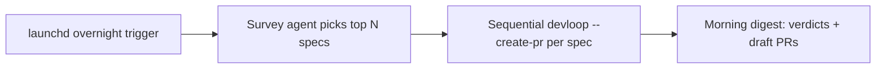

# Devloop Nightshift Mode
Add a headless `devloop nightshift` mode that surveys a repo, picks the 2-3 highest-leverage improvements, runs each through the existing spec-to-PR loop while you sleep, and leaves a single morning digest to review.

## Problem
During waking hours the user drives agents interactively to ship focused work. Overnight that leverage is idle: the machine sits unused while a queue of high-value, well-scoped improvements goes unstarted. Today the only way to get autonomous overnight work is to hand-write specs the night before and manually launch `devloop --create-pr` on each, which defeats the point. There is no headless path that both *decides what to work on* and *executes it* without a human at the terminal, and no single artifact to review in the morning.

## Outcome
A scheduled, non-interactive `devloop nightshift` run selects the 2-3 highest-leverage improvements in a target repository, drives each through the existing coder/reviewer loop in its own worktree, opens a draft PR per accepted change, and writes one `digest.md` summarizing every run's verdict and PR link. The user installs the overnight trigger once with `devloop nightshift --install-schedule 02:00`, wakes up to a set of review-ready draft PRs plus a digest, and never touches a terminal to make it happen. Both Claude Code and Codex run headlessly across the night (survey/review by one, implementation by the other).

## Scope
- In: `devloop` (new `nightshift` subcommand and its `main()` dispatch), `README.md`, `scripts/devloop_test.sh`, and help/usage text.
- In: headless survey that writes N devloop-ready specs, a sequential orchestrator over those specs reusing the existing `--create-pr` run path, and a per-repo morning digest.
- In: new global/local config keys `nightshift_repos`, `nightshift_count`, `nightshift_coder`, `nightshift_reviewer`, `nightshift_survey_agent`, `nightshift_max_passes`, `nightshift_schedule`, wired through the config whitelist and the interactive Settings menu.
- In: macOS launchd install/uninstall (`--install-schedule`, `--uninstall-schedule`) writing a `LaunchAgent` plist, plus a `--dry-run` that surveys and writes specs without running the loop, and a `--status` that prints the latest digest path.
- In: test seams so external effects are injectable — `DEVLOOP_RUN_CMD` (the per-spec runner), `DEVLOOP_LAUNCHCTL`, `DEVLOOP_LAUNCH_AGENTS_DIR`.
- Out: Linux/systemd/cron scheduling, `sudo pmset` power-management side effects (the command is printed, never executed), remote/CI execution, Slack/email notification delivery, parallel worktree execution, auto-merging or un-drafting PRs, and any change to the interactive `devloop spec` flow.

## Behavior
### Happy path
1. The user runs `devloop nightshift --install-schedule 02:00` once, having set `nightshift_repos` (or passing `--repo <path>`); devloop writes `~/Library/LaunchAgents/sh.devloop.nightshift.plist`, loads it via `launchctl`, saves `nightshift_schedule=02:00`, and prints the plist path plus the optional `sudo pmset repeat wake ...` line to wake a sleeping Mac.
2. At 02:00 launchd runs `devloop nightshift` non-interactively for each configured repo. Nightshift forces plain output, never opens a worktree shell, and never runs the update prompt.
3. Per repo, nightshift creates `.devloop/nightshift/<date>/` and launches the survey agent headlessly with the bundled `devloop-spec` skill, instructing it to select the top `nightshift_count` independent, worktree-sized improvements and write one devloop-ready spec each to `.devloop/nightshift/<date>/specs/NN-<slug>.md`, plus a `survey.md` rationale. The agent writes specs only; it does not implement.
4. Nightshift lints each generated spec, then for each valid spec in sorted order runs the existing loop headlessly (`devloop --plain --create-pr --coder <c> --reviewer <r> --timeout-minutes <t> <spec> <nightshift_max_passes>`), one at a time.
5. Each run implements in an isolated sibling worktree, self-reviews across passes, commits, and opens/maintains a draft PR — exactly as `--create-pr` does today.
6. After the last run, nightshift writes `.devloop/nightshift/<date>/digest.md` (and `digest.html` when the report format is html) with one row per spec: title, final verdict/status, branch, draft PR link, and report path, followed by the survey rationale. It updates a `.devloop/nightshift/latest` pointer.
7. In the morning the user runs `devloop nightshift --status`, opens the digest, and reviews the draft PRs.

### Edge cases
- No repos resolvable: `devloop nightshift` (and `--install-schedule`) exit nonzero with a clear message that `nightshift_repos` or `--repo` is required.
- Survey writes zero valid specs: that repo's digest records a survey-failure row and nightshift continues to the next repo without aborting the night.
- A single spec's run fails, stalls, or times out: its digest row records the terminal status (e.g. `stalled`, `unclear`, `timeout`, `coder-error`); remaining specs still run.
- `--dry-run`: surveys and writes specs plus a digest listing them and the rationale, but runs no loop and opens no PR.
- Invalid schedule time: `--install-schedule 9pm` exits nonzero; only `HH:MM` with `HH` 00-23 and `MM` 00-59 is accepted.
- `--count N` out of range: clamped to 1-5; config `nightshift_count` is likewise clamped when read.
- Already scheduled: re-running `--install-schedule` replaces the existing plist and reloads it idempotently.
- `--uninstall-schedule` when nothing is installed: exits 0, reporting nothing to remove.
- No TTY / scheduled context: no prompts, no gum/fzf/glow UI, no post-run shell, regardless of terminal state.
- `gh` missing or unauthenticated, or repo has no origin: the run's existing preflight fails and that spec's digest row records the preflight error; the night continues.

## Acceptance criteria
1. `devloop nightshift` is dispatched from `main()` and documented in plain help, TUI help, and the README command table.
2. `devloop nightshift` and every scheduled invocation force non-interactive behavior: plain output, no worktree shell, and no automatic update prompt, even when stdin/stdout are TTYs.
3. The survey step builds a prompt that references the installed `devloop-spec` skill, the requested count, the current date, the `.devloop/nightshift/<date>/specs` write directory, and an explicit "write specs only, do not implement" constraint, and launches the survey agent through the existing headless `run_with_prompt` path (not the interactive spec launcher).
4. Given a survey agent that writes N specs, nightshift runs each valid spec exactly once, in sorted order, through the `--create-pr` run path with the resolved coder, reviewer, per-spec max passes, and timeout.
5. Per-spec runs are sequential: run K+1 does not start until run K's process exits.
6. A run that fails, stalls, is unclear, or times out is recorded in the digest and does not prevent subsequent specs from running.
7. `.devloop/nightshift/<date>/digest.md` is created with one row per spec containing its title, terminal status, branch, draft PR link (or a clear "no PR" marker), and report path, plus the survey rationale, and `.devloop/nightshift/latest` points at the newest run.
8. `--dry-run` writes specs and a digest but invokes no per-spec run and opens no PR.
9. `--status` prints the path to the latest digest, or a clear message when none exists.
10. `nightshift_repos`, `nightshift_count`, `nightshift_coder`, `nightshift_reviewer`, `nightshift_survey_agent`, `nightshift_max_passes`, and `nightshift_schedule` are readable and writable through the config helpers with local-overrides-global precedence; the config key whitelist rejects unknown keys; `nightshift_count` is clamped to 1-5 and agent keys are normalized to `codex`/`claude`.
11. `--install-schedule HH:MM` writes a `sh.devloop.nightshift` plist under `${DEVLOOP_LAUNCH_AGENTS_DIR:-$HOME/Library/LaunchAgents}` whose `StartCalendarInterval` encodes the parsed hour and minute, whose `ProgramArguments` invoke the resolved absolute `devloop` path with `nightshift` and the resolved repos, and whose `EnvironmentVariables.PATH`, `StandardOutPath`, and `StandardErrorPath` are populated; it then loads the agent via `${DEVLOOP_LAUNCHCTL:-launchctl}` and persists `nightshift_schedule`.
12. `--install-schedule` never invokes `sudo`; it prints the exact `pmset` wake command for the user to run and the written plist path.
13. `--uninstall-schedule` unloads via `${DEVLOOP_LAUNCHCTL:-launchctl}`, removes the plist, and clears `nightshift_schedule`, exiting 0 whether or not one existed.
14. An invalid `--install-schedule` time and an unresolvable repo set each exit nonzero with a specific error and write no plist.
15. `scripts/devloop_test.sh` covers: dispatch/help/README presence, headless invariants, the survey prompt builder, orchestration over a stubbed `DEVLOOP_RUN_CMD` including a mid-list failure, digest and `latest` generation, `--dry-run`, `--status`, every new config key (set/get/remove, precedence, clamping, whitelist rejection), plist generation contents, install load via a stubbed `DEVLOOP_LAUNCHCTL`, uninstall removal, and the two nonzero error paths.
16. The project function coverage gate in `scripts/devloop_test.sh` stays at 100% for every new function.

## Test plan
- Red: Add failing Bash tests in `scripts/devloop_test.sh` that source `devloop` with `DEVLOOP_LIB=1` and exercise the new functions directly, using `PATH` stubs for the survey agent, a `DEVLOOP_RUN_CMD` stub that records invocations and writes fake track/PR outputs, and `DEVLOOP_LAUNCHCTL` / `DEVLOOP_LAUNCH_AGENTS_DIR` overrides under a temp `HOME` so no real `launchctl`, `pmset`, agent, or network call runs.
- Green: `bash scripts/devloop_test.sh`
- Full: `bash scripts/devloop_test.sh`
- Coverage: `bash scripts/devloop_test.sh` must keep the project function coverage gate passing at 100%.

## Constraints
- Must: keep devloop a single Bash CLI and reuse existing machinery — `run_with_prompt` for the headless survey, the `run_command`/`--create-pr` run path for execution, `lint_spec_file` for spec validation, the `config_file_value`/`write_config_value`/`remove_config_value` helpers (extending their key whitelist) for the new keys, and the bundled `devloop-spec` skill for spec quality. Do not fork the spec format or the loop.
- Must: shell out to a fresh `devloop` process per spec (via `DEVLOOP_RUN_CMD`, defaulting to the resolved script path) so each run gets clean global state (`STATUS`, `PASSES`, the `COMMIT_*` arrays) rather than reusing `run_devloop` in-process across specs.
- Must: run specs sequentially and only ever produce feature branches and draft PRs; never push to or modify the base branch, never un-draft or merge.
- Must: make all external effects injectable for tests — the per-spec runner, `launchctl`, and the LaunchAgents directory — and never call `sudo`, `pmset`, real `launchctl`, or a live agent from the test suite.
- Must: force `USE_TUI=false` and `ENTER_WORKTREE=false` on entry and skip `maybe_prompt_update`, so scheduled runs never block on a prompt or open a shell.
- Avoid: introducing Python, Node, cron, systemd, telemetry, a daemon that runs outside launchd, parallel execution, or committing generated `.devloop/nightshift/` artifacts.
- Existing convention: `VERSION` is the single version source, `.devloop/specs/*.md` is where tracked specs live, `scripts/devloop_test.sh` is the shell suite, config is `key=value` in `.devloop/config` and `~/.devloop/config`, and user-visible CLI changes are documented in `README.md`.

## Notes
- Recommended landing as a small stack to honor the small-PR rule: (1) core loop — `nightshift` subcommand, survey, sequential orchestrator, digest, config keys, headless invariants, `--dry-run`/`--status`; then (2) scheduler — `--install-schedule`/`--uninstall-schedule` launchd plist stacked on (1). If the combined diff stays tight it can land as one PR; split if it exceeds ~300 LOC.
- Survey agent default: `nightshift_survey_agent` defaults to the configured reviewer (`claude`); `nightshift_coder`/`nightshift_reviewer` default to `devloop_coder`/`devloop_reviewer` (`codex`/`claude`). A full night therefore exercises both Claude Code and Codex headlessly, as intended.
- launchd gotcha to handle: LaunchAgents inherit a minimal `PATH`, so the plist must bake a working `PATH` (capture the installer's `PATH` into `EnvironmentVariables`) or `codex`/`claude`/`gh` will not resolve at 02:00. Load with modern `launchctl bootstrap gui/$(id -u) <plist>` and fall back to `launchctl load -w`; mirror for unload/`bootout`.
- Power management: a fully asleep Mac will not fire `StartCalendarInterval` on time. `--install-schedule` prints `sudo pmset repeat wake MTWRFSU HH:MM` (and notes it needs `sudo` and an awake-or-plugged-in machine) rather than running it, keeping nightshift side-effect-free on power settings.
- Digest status vocabulary should reuse the loop's existing terminal statuses (`accepted`, `unclear`, `stalled`, `no-verdict`, `timeout`, `coder-error`, `reviewer-error`, `verify-error`, `preflight-error`, `pr-error`, `review-missing`, `max-turns`) read from each run's track file, so the morning summary speaks the same language as `devloop status`.
- Optional future hook (out of scope): a `nightshift_notify` command (à la `.devloop/verify`) receiving the digest path, so Slack/email delivery can be wired without baking a provider into devloop.
- Spec placement: written to `~/Projects/devloop/.devloop/specs/` to match sibling specs and be runnable as `devloop --create-pr .devloop/specs/2026-07-05-nightshift.md`; copy to `~/Projects/specs/devloop/` if you also track it in the personal specs repo.
