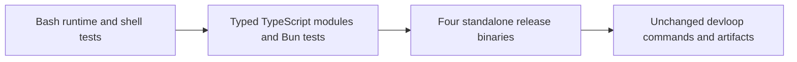

# Migrate the CLI runtime to TypeScript and Bun
Replace the single-file Bash runtime with a typed, modular Bun application while preserving every observable CLI contract and the existing no-runtime-dependency install experience.

## Problem
The active CLI runtime is 5,424 lines of Bash backed by a 3,502-line shell suite. When a command, process boundary, or failure path changes, maintainers must reason across shared shell globals, filesystem side effects, and subprocess status handling without static typing or module boundaries. The suite currently passes all named behavior cases and its 100% project-function coverage gate, but extending the single-file runtime safely becomes harder as the command surface grows.

## Outcome
Devloop is developed as a strictly typed Bun workspace with a modular TypeScript runtime and Bun test suite. Existing users observe the same commands, prompts, text, exit codes, configuration, generated artifacts, Git and GitHub effects, retry behavior, and recovery behavior. Releases provide verified standalone binaries for macOS arm64, macOS x64, Linux glibc arm64, and Linux glibc x64, so remote-install and update users do not need Bun installed.

## Scope
- In: the root `devloop` entrypoint; all behavior currently owned by the Bash runtime; `src/` command, core, integration, reporting, and UI modules; runtime tests under `tests/`; root Bun workspace files; `site/` migration from pnpm to the root Bun workspace; source installation; remote installation, update, uninstall, release packaging, and CI changes required by platform-specific binaries; user and contributor documentation.
- Out: npm publication; Windows binaries; Alpine or other musl binaries; new CLI commands, flags, prompts, configuration keys, artifact schemas, reports, telemetry, or product behavior; conversion of `scripts/install.sh`, `scripts/install.remote.sh`, `scripts/uninstall.sh`, `scripts/release.sh`, `scripts/skill_helpers.sh`, `skills/devloop-spec/scripts/render.sh`, or `site/public/install` from Bash; redesign of the site or bundled skills.

## Implementation map
1. `package.json`, `bun.lock`, `bunfig.toml`, `tsconfig.json` / root workspace and quality gates: make Bun the only package manager, declare `site/` as a workspace, expose development, typecheck, test, coverage, site-build, current-platform build, and full-check scripts, and enforce strict TypeScript plus 100% line, function, and statement coverage for runtime source. Keep `VERSION` as the only release-version source and keep the package private because npm publication is out of scope.
2. `devloop`, `src/cli.ts`, `src/commands/*.ts` / executable dispatch: replace the Bash runtime with an executable TypeScript entrypoint and command router for welcome/help, run, update, spec, nightshift, menu, reports, status, clean, continue, and doctor. Keep `devloop` as a source-checkout entrypoint to `src/cli.ts` with no duplicated product logic; the release archive substitutes the compiled executable at the same `devloop` path.
3. `src/core/*.ts` / typed runtime state and orchestration: own configuration precedence and atomic writes, spec and track parsing, obligation parsing, work-item naming, event timing, run status, pass state, artifact paths, agent selection, timeout state, and worktree lifecycle using explicit types instead of shared shell globals. Preserve current defaults, accepted legacy files, ordering, date/time formats, and `.devloop/` schemas.
4. `src/integrations/*.ts` / external boundaries: centralize filesystem operations, process spawning and termination, Git, GitHub CLI, tmux, launchd, Codex, Claude Code, and platform detection. Pass arguments as arrays without shell interpolation, preserve stdout and stderr routing and exit statuses, keep environment-variable test seams, and resolve the installed root through the real executable path so symlinked and compiled launches can find `VERSION`, scripts, and bundled skills.
5. `src/ui/*.ts`, `src/reporting/*.ts` / terminal and report contracts: preserve plain and TUI selection, gum/fzf/glow fallbacks, prompts, menu navigation, spinner semantics, report metadata, Markdown and HTML report prompts, result summaries, and viewing behavior. Preserve exact stable text and ordering, including the current menu order `interview`, `run`, `continue`, `open reports`, `settings`, `doctor`, `quit`; only elapsed timing and individual spinner frames may vary.
6. `tests/**/*.test.ts`, `tests/helpers/*`, retained supporting-shell coverage / regression seam: port every named runtime behavior block from `scripts/devloop_test.sh` into fixture-style Bun tests that execute the public CLI or the highest stable module boundary. Use temporary Git repositories and fake executables for tmux, gum, fzf, glow, gh, codex, claude, launchctl, curl, and failure injection. Retain or narrow shell coverage only where needed for the Bash scripts that remain, and make the root full-check command run both suites.
7. `scripts/build.ts`, `scripts/install.sh`, `scripts/install.remote.sh`, `scripts/uninstall.sh` / build and installation: compile the TypeScript entrypoint into standalone `darwin-arm64`, `darwin-x64`, `linux-arm64`, and baseline-compatible `linux-x64` executables; package the existing companion scripts, `VERSION`, and bundled skills beside each binary; detect and normalize `uname` output before download; verify the matching checksum; stage and replace installs atomically; preserve source-install symlinking, skill management, dependency checks, path guidance, dry-run output, and uninstall ownership rules.
8. `src/commands/update.ts`, `scripts/release.sh`, `.github/workflows/release.yml` / update and release contract: replace the generic release archive with platform-qualified archives and checksums, keep the version-PR and tag-publish flow, and build plus boot-test each binary on a matching GitHub-hosted architecture before release creation. Preserve latest-version resolution, SemVer comparison, main-ancestry guards, version-file guards, changelog validation, checksum failure handling, and rollback after a failed tag push.
9. `site/package.json`, `site/pnpm-lock.yaml`, `site/README.md`, root workspace files / site package-manager migration: remove pnpm-only configuration and the pnpm lockfile, install site dependencies through the root `bun.lock`, preserve Vite and Tailwind output, and update local and Cloudflare Pages commands for the root workspace without changing the deployed site.
10. `.github/workflows/ci.yml`, `README.md`, `CONTRIBUTING.md`, `AGENTS.md`, `.gitignore` / repository contract: install pinned Bun in CI, run frozen installation, strict typechecking, Bun coverage, remaining Bash syntax and shellcheck gates, site build, and a current-platform executable check on macOS and Linux. Update runtime architecture, dependencies, source setup, test commands, release assets, and supported-platform documentation without changing the public usage examples except where contributor commands or release filenames must change.

## Behavior
### Happy path
1. A contributor runs `bun install --frozen-lockfile` at the repository root and receives one workspace installation and one lockfile for the CLI and `site/`.
2. The contributor invokes `./devloop`, a root package script, or `bun run src/cli.ts`; the TypeScript router selects the same command and produces the same stable output, exit code, prompts, files, Git state, and external command arguments as the Bash baseline.
3. A normal run validates the spec and dependencies, creates or reuses the intended worktree and branch, invokes the selected coder and reviewer with the current prompts and session handling, commits eligible paths, verifies obligations, retries when required, updates the track and optional draft PR, writes the selected report format, and prints the same terminal result.
4. A tagged release builds four platform-qualified archives and checksums. Matching architecture jobs execute each binary's `--version` and `--help` and run a packaged-resource check before GitHub Release publication.
5. The remote installer or `devloop update` detects the host platform, downloads and verifies its matching archive, stages the versioned runtime, installs managed skills, and atomically repoints `devloop`; the resulting command runs without Bun on the user's `PATH`.
6. `bun run site:build` produces the same static site output, and the documented Cloudflare build runs from the root Bun workspace.

### Failure and edge cases
- F1 (unsupported operating system, CPU, or libc): the installer and build target parser fail before download or installation with an actionable supported-target message; no installed version, symlink, or managed skill is changed.
- F2 (missing, malformed, or checksum-mismatched release asset): install and update return non-zero, retain the previously installed runtime and symlink, remove temporary staging files, and never execute the unverified binary.
- F3 (invalid command input, configuration, spec, track, agent, or dependency): the TypeScript runtime preserves the Bash baseline's validation order, stable stderr text, usage output, exit code, and rule that no later state transition occurs after validation fails.
- F4 (agent, verify hook, report synthesis, child process, or timeout failure): the runtime captures the same logs and status, terminates the child process tree on timeout or interruption, preserves resumable track evidence, avoids an unintended commit, and exits through the current final-status mapping.
- F5 (Git worktree, commit, push, PR lookup, PR creation, or PR comment partial failure): the source checkout's pre-existing dirty paths remain untouched, generated changes are limited to eligible paths, durable PR review state is reused on retry, the failure is recorded in the current artifact or result surface, and cleanup never removes a user-owned worktree.
- F6 (non-TTY execution or missing optional display tool): redirected, piped, and scheduled runs remain foreground and plain; interactive runs retain tmux behavior; gum, fzf, glow, browser opener, and pager fallbacks preserve the current choice ordering, cancel status, and output streams.
- F7 (source workspace dependency, typecheck, test, site build, or executable build failure): the full gate fails before release packaging, generated `dist/`, coverage, dependency cache, and temporary artifacts remain uncommitted, and an existing installed source link is not replaced with an incomplete build.

## Invariants
- I1: Stable stdout, stderr, prompt text, option and item ordering, exit codes, generated content, filesystem effects, Git effects, and external command arguments match the passing Bash baseline; only timing values and spinner-frame rendering may differ.
- I2: `VERSION` remains the single release-version source, and release preparation keeps `site/public/VERSION` synchronized without introducing `package.json` as another version authority.
- I3: Remote install, update, and normal CLI execution do not require Bun, Node.js, npm, or pnpm on the user's machine.
- I4: Source checkout changes, user-owned branches and worktrees, existing installations, modified managed skills, and partial run evidence survive failures and retries under the same ownership rules as today.
- I5: The migration adds no telemetry and does not weaken command-injection defenses, checksum verification, path validation, permission handling, credential boundaries, or the warning that specs and `.devloop/verify` are user-authorized code.
- I6: Existing `.devloop/config`, `~/.devloop/config`, spec files, tracks, reviews, logs, session IDs, worktrees, reports, and installed managed-skill markers remain readable and resumable without migration.
- I7: Release support is exactly macOS arm64, macOS x64, Linux glibc arm64, and Linux glibc x64; Windows and musl hosts are rejected explicitly rather than receiving an incompatible binary.
- I8: Runtime TypeScript maintains 100% line, function, and statement coverage, and every named behavior block in the passing shell baseline has equivalent automated evidence before its Bash runtime test is removed.
- I9: Product behavior has one TypeScript implementation after migration; no hidden Bash fallback, compatibility runtime, or second package-manager lockfile remains.

## Acceptance criteria
1. A frozen root Bun install resolves the CLI and `site/` from one `bun.lock`, with no pnpm, npm, or Yarn lockfile or pnpm-only package configuration remaining.
2. The TypeScript entrypoint implements every command, alias, flag, positional argument, default, environment override, config key, and dispatch precedence exposed by the current `devloop` runtime.
3. Stable user-visible text, stream selection, item ordering, prompts, exit codes, generated artifacts, Git effects, and external command arguments match the passing Bash baseline, excluding elapsed timing and spinner frames.
4. The implement-review-retry loop preserves current strict obligation gates, verify-hook behavior, session reuse, eligible-path commits, worktree behavior, PR lifecycle, terminal statuses, continuation behavior, and HTML or Markdown report generation.
5. Pre-migration config files and `.devloop/` specs, tracks, reviews, reports, logs, worktrees, sessions, and managed-skill markers continue to work without conversion.
6. Source install, remote install, update, dry-run, dependency setup, skill preservation, checksum rejection, atomic replacement, path guidance, and uninstall behavior pass fixture tests with platform-qualified assets.
7. Tagged releases contain verified, executable archives for `darwin-arm64`, `darwin-x64`, `linux-arm64`, and `linux-x64`, and each binary is boot-tested on a matching operating-system and CPU runner before publication.
8. A clean environment containing the packaged release and the existing external CLI dependencies, but no Bun, Node.js, npm, or pnpm executable, runs `devloop --version`, `devloop --help`, and packaged skill discovery successfully.
9. Bun tests preserve every named case in the baseline `scripts/devloop_test.sh`, including the exact seven-item interactive menu order, and the configured coverage gate reports 100% lines, functions, and statements for runtime TypeScript.
10. CI and release workflows run frozen dependency installation, strict typechecking, Bun tests and coverage, remaining Bash syntax and shellcheck checks, the site build, release guards, binary builds, and target-native binary checks.
11. README, contributor, agent, site, install, supported-platform, test, and release documentation describes the TypeScript architecture, Bun workflow, four release targets, and no-Bun end-user guarantee accurately.
12. The 5,424-line Bash runtime and its superseded runtime-test paths are absent, the root `devloop` source entry contains no product logic outside TypeScript, and the supporting deployment and skill scripts explicitly kept in scope remain Bash.

## Test plan
### Proof obligations
- AC1: workspace fixture and CI install run `bun install --frozen-lockfile`, assert one root `bun.lock`, reject foreign lockfiles and pnpm configuration, and build `site/` through the root workspace.
- AC2, AC3, I1, F3, F6: table-driven CLI parity tests cover all help/version forms, commands, aliases, flags, invalid and boundary arguments, config precedence, plain and TUI paths, exact menu order, non-TTY behavior, optional-tool fallbacks, stdout/stderr, exit codes, snapshots with dynamic fields normalized, and fake-command argv capture.
- AC4, I4, F4, F5: temporary-repository end-to-end tests cover accept, reject then accept, unclear and malformed reviews, strict matrices, verify pass/fail, timeout and process termination, no changes, dirty-file preservation, commits, continuation, tmux, worktrees, PR creation/reuse/comments/failures, report formats, and cleanup ownership.
- AC5, I6: compatibility fixtures created in the current config, spec, track, review, report, session, worktree, and skill-marker formats are consumed by the TypeScript commands and continued without rewriting unrelated fields.
- AC6, I3, F1, F2, F7: source and remote installer fixtures inject all supported and unsupported `uname` results, asset and checksum failures, dependency failures, dry runs, modified skills, interrupted staging, source build failure, update, and uninstall, then assert atomic paths, symlinks, cleanup, messages, statuses, and an unchanged prior install.
- AC7, I7: release tests assert the four exact target and archive mappings, then the release workflow executes version/help/resource checks on `macos-15-intel`, an arm64 macOS runner, `ubuntu-24.04`, and `ubuntu-24.04-arm` before publishing assets.
- AC8: a clean PATH fixture containing only required system and fake external tools executes the packaged binary and skill lookup while explicit Bun, Node.js, npm, and pnpm probes fail.
- AC9, I8: a checked parity inventory maps every baseline `ok` block to a Bun or retained supporting-shell test, and `bun test --coverage` fails below `1.0` for lines, functions, or statements.
- AC10, I2: workflow and release-helper tests assert frozen Bun setup, test and build gates, tag ancestry, SemVer, `VERSION` and `site/public/VERSION` equality, changelog freshness, target-native checks, asset completeness, and failed-tag-push rollback.
- AC11: documentation assertions search for the canonical source install, test, site, release, supported-platform, and no-runtime-dependency commands and reject stale single-file Bash and pnpm instructions.
- AC12, I9: repository inventory tests reject the old Bash runtime body, runtime test sourcing, duplicate CLI implementations, foreign lockfiles, committed `dist/` or coverage output, and product logic in the root source entrypoint.
- I5: adversarial integration tests pass paths, specs, config values, branch names, prompts, and tool output containing whitespace and shell metacharacters; assert argv-safe spawning, path containment, checksum enforcement, no credential rendering, and zero telemetry endpoints.

### Commands
- Red: port the current named behavior inventory and fixture helpers first, point them at the new TypeScript entrypoint, and demonstrate failures before replacing each Bash-owned behavior.
- Green: `bun test tests/<targeted-suite>.test.ts`, `bun run typecheck`, `bun run build:current`, `bun run site:build`, and the narrowed supporting-shell test command.
- Full: `bun install --frozen-lockfile && bun run check`.
- Coverage: `bun test --coverage` with `bunfig.toml` thresholds `{ lines = 1.0, functions = 1.0, statements = 1.0 }`, plus the retained 100% project-function coverage gate for Bash scripts that remain.

## Review focus
- Process and terminal boundaries: inspect argument-array construction, stdout/stderr capture, cancellation, timeout deadlines, child-tree termination, session ID reuse, tmux launches, and adjacent Codex, Claude Code, verify-hook, report-synthesis, and pager paths for quoting, status-loss, or orphan-process regressions.
- State and ownership boundaries: inspect config writes, spec and track parsing, eligible-path commits, dirty-file preservation, worktree cleanup, retry and continuation state, PR durability, managed-skill checksums, and adjacent cleanup paths for schema drift, destructive cleanup, or partial-failure data loss.
- Distribution boundary: inspect executable-root resolution through symlinks, embedded versus external resources, target normalization, baseline Linux x64 selection, per-asset checksums, atomic update rollback, release matrix completeness, and adjacent version and changelog guards for a binary that works in CI but cannot update or locate its packaged skills.

## Constraints
- Must: implement the user-approved single large migration PR despite the repository's usual 300-line PR guidance; use strict TypeScript and Bun for package management, runtime, tests, workspace management, and standalone compilation; preserve the exact stable behavior accepted above; maintain 100% coverage; support the four approved targets; keep end-user execution independent of JavaScript runtimes.
- Avoid: a staged multi-PR migration, dual Bash and TypeScript product runtimes, npm publishing, Node SEA, pnpm/npm/Yarn lockfiles, Windows or musl artifacts, shell-string command construction, untyped escape hatches, broad dependency churn, generated runtime or coverage artifacts in Git, or opportunistic product and site redesign.
- Existing convention: keep `VERSION` authoritative; use fixture-style tests that assert files, Git state, status codes, argv, and user-visible output; keep generated `.devloop/` data uncommitted; preserve local and global config precedence; keep deployment scripts readable Bash; update README examples whenever user-visible output changes.

## Notes
The user explicitly overrode the normal worktree-sized and approximately 300-line scope guard and requires one large PR for the complete migration. Behavioral parity is the goal, not a compatibility layer: the old Bash runtime is removed only after the new implementation proves its contracts.

The current baseline was verified on 2026-07-28 with `bash scripts/devloop_test.sh`. All named cases passed, including installer, update, tmux, nightshift, spec, PR, run-loop, dirty-file, verify-failure, report, and 100% project-function coverage cases. The working tree already contained user-authored, uncommitted menu-label changes across `devloop`, `README.md`, and `scripts/devloop_test.sh` that fix the interactive menu contract to `interview`, `run`, `continue`, `open reports`, `settings`, `doctor`, `quit`; this exact order is part of the spec even if those diffs are not present in the implementation worktree.

Material decisions: Bun is used throughout the repository, including the site workspace; npm publication is excluded; supporting deployment and skill scripts remain Bash; released binaries embed Bun so end users do not install it; the target matrix is macOS arm64/x64 and Linux glibc arm64/x64; Alpine/musl and Windows are unsupported; exact stable output is preserved while elapsed timing and spinner frames may differ.

Implementation references verified during discovery: Bun standalone executables and target names at `https://bun.com/docs/bundler/executables`; Bun coverage thresholds at `https://bun.com/docs/test/code-coverage`; current matching GitHub-hosted runner architectures at `https://docs.github.com/en/actions/reference/runners/github-hosted-runners`.
