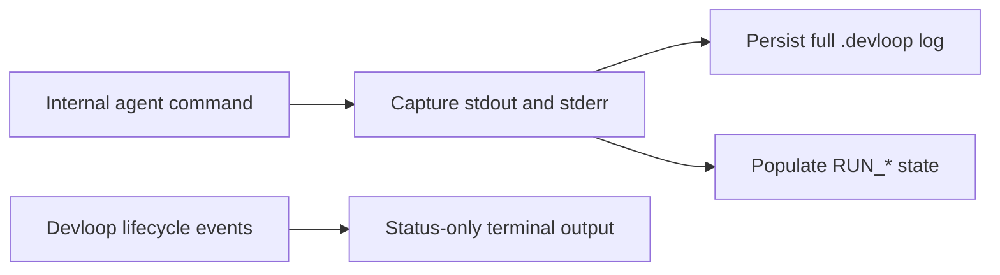

# Keep agent transcripts out of run output
Stop replaying captured agent output into the terminal so devloop runs remain readable while full transcripts stay available in logs.

## Problem
During a devloop run, the terminal replays the full stdout and stderr produced by internal agent commands. Large diffs, hook messages, token counts, and other session transcript lines overwhelm the lifecycle statuses, making it difficult to see which pass is running, whether a step succeeded, and what devloop is doing next.

## Outcome
TUI and `--plain` runs show devloop lifecycle statuses, results, and devloop-authored warnings without displaying agent transcripts. The complete captured output remains available in the existing `.devloop/logs/` files and internal `RUN_*` result variables.

## Scope
- In: terminal output from every internal agent command routed through `run_with_prompt`, including naming, implementation, review, report generation, and nightshift survey; existing per-invocation logs; regression coverage; README runtime documentation
- Out: new quiet or verbose flags, changes to agent commands or prompts, changes to status-line formatting, log locations or formats, report contents, session persistence, and non-agent command output

## Implementation map
1. `devloop` / `run_with_prompt`: preserve stdout and stderr capture, `RUN_STDOUT`, `RUN_STDERR`, `RUN_OUTPUT`, exit-code handling, timeout handling, and log persistence, but stop replaying captured agent lines through `event_log`.
2. `devloop` / `event_log`, `event_step`, and `event_done`: retain devloop-owned lifecycle and warning output, including explicit warnings such as a skipped spec backlink; only captured agent output should become silent.
3. `scripts/devloop_test.sh` / shared runner and end-to-end fixtures: add regression assertions that distinct agent stdout and stderr markers are absent from both terminal modes, remain present in logs on success and failure, and do not break internal output consumers.
4. `README.md` / Runtime: document that the terminal shows lifecycle status while complete internal agent output is written to `.devloop/logs/`.

## Behavior
### Happy path
1. Devloop starts an internal agent command during a TUI or `--plain` run.
2. Devloop captures the command's stdout, stderr, and exit status without replaying stdout or stderr into the terminal.
3. Devloop prints its existing lifecycle statuses, continues using captured output internally, and saves the complete output to the existing invocation log.

### Failure and edge cases
- F1 (agent emits a large successful transcript): no transcript lines reach the terminal, the full output is saved in the existing log, and the lifecycle step completes normally.
- F2 (agent exits non-zero after writing stdout or stderr): no transcript lines reach the terminal, the existing failure status remains visible, the complete output is saved for diagnosis, and devloop preserves the non-zero result.
- F3 (captured output contains a Codex session identifier or other machine-consumed result): devloop continues populating and parsing the `RUN_*` variables exactly as before even though the output is not displayed.
- F4 (devloop emits an explicit event warning): the warning remains visible because suppression applies only to captured agent output, not devloop-authored messages.
- F5 (TUI is unavailable or output is redirected): `--plain` and non-interactive execution use the same transcript-suppression behavior without requiring a TTY.

## Invariants
- I1: Every internal agent invocation that supplies a log path persists the same captured stdout and stderr on both success and failure.
- I2: `RUN_CODE`, `RUN_STDOUT`, `RUN_STDERR`, and `RUN_OUTPUT` retain their current meanings and remain available to session extraction and other internal consumers.
- I3: Lifecycle statuses, final run results, and explicit devloop-authored warnings remain visible.
- I4: Transcript suppression is the default in both TUI and `--plain` modes and requires no new configuration or CLI flag.

## Acceptance criteria
1. A TUI run does not display stdout or stderr captured from any internal agent command.
2. A `--plain` or redirected run does not display stdout or stderr captured from any internal agent command.
3. Successful and failed internal agent commands continue writing their complete captured output to the existing log path.
4. Internal consumers continue receiving the captured exit code, stdout, stderr, and combined output through the existing `RUN_*` variables.
5. Devloop lifecycle statuses, final results, and explicit event warnings remain visible after transcript replay is removed.
6. The README states that internal agent transcripts are stored in `.devloop/logs/` rather than printed during a run.

## Test plan
### Proof obligations
- AC1, I4, F1: run a fixture command with distinct stdout and stderr markers under forced TUI mode and assert neither marker appears in captured terminal output.
- AC2, F5: run the same fixture under `--plain` or redirected output and assert neither marker appears in captured terminal output.
- AC3, I1, F2: exercise successful and non-zero fixture commands and assert both streams remain in each supplied log while the exit result is preserved.
- AC4, I2, F3: assert `RUN_CODE`, `RUN_STDOUT`, `RUN_STDERR`, and `RUN_OUTPUT` retain the fixture values needed by existing session extraction and orchestration.
- AC5, I3, F4: assert lifecycle status output and an explicit `event_log` warning remain visible while agent markers remain absent.
- AC6: inspect the Runtime section assertion or README text for the documented status-only console and `.devloop/logs/` behavior.

### Commands
- Red: add the transcript-suppression regression to `scripts/devloop_test.sh` and confirm it fails because `run_with_prompt` currently replays captured lines through `event_log`.
- Green: `bash scripts/devloop_test.sh`
- Full: `bash scripts/devloop_test.sh`
- Coverage: no coverage instrumentation exists for this Bash project; exercise every changed output branch in `scripts/devloop_test.sh`.

## Review focus
- Verify suppression happens only at the captured-agent-output boundary so devloop lifecycle statuses and explicit warnings are not accidentally silenced.
- Verify removing terminal replay does not remove or alter log persistence, `RUN_*` values, Codex session-id extraction, non-zero exit handling, or timeout handling.
- Inspect all `run_with_prompt` callers for assumptions that their captured stdout or stderr is user-visible instead of consumed through logs or `RUN_*`.

## Constraints
- Must: keep status-only output as the default for both TUI and `--plain` runs while preserving complete agent logs.
- Avoid: adding a verbose compatibility flag, agent-specific branches, changing prompts, or suppressing devloop-authored lifecycle and warning messages.
- Existing convention: keep the root `devloop` executable as the runtime, use small Bash functions with quoted expansions and explicit status handling, and cover behavior in `scripts/devloop_test.sh`.

## Notes
- Decision: all internal agent invocations using `run_with_prompt` are silent in the terminal, not only coder and reviewer passes.
- Decision: failures show the existing devloop failure status and retain diagnostic output in the log; raw agent output is not dumped to the terminal on failure.
- Decision: complete output continues to mean the existing combined stdout-then-stderr log representation; this change does not alter ordering or format.
- Decision: no opt-in verbose mode is included in this implementation slice.
- Assumption: existing explicit `event_log` calls represent devloop-owned warnings and remain user-visible.
