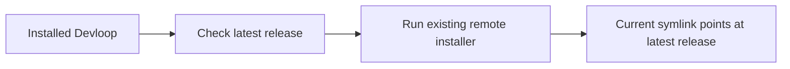

# Devloop Upgrade Command
Add an explicit upgrade command and an interactive startup prompt so installed Devloop users can move to the latest release without uninstalling first.

## Problem
Updating an already installed Devloop currently requires remembering the uninstall script and rerunning the curl installer manually. This hurts maintainers and users whenever a new release is available, because the update path is outside the CLI they already use.

## Outcome
Users can run `devloop upgrade` to install the latest released Devloop. When a user opens the interactive Devloop entry point and a newer release exists, Devloop prompts once in that session to upgrade or skip before continuing.

## Scope
- In: `devloop`, `scripts/install.remote.sh`, `README.md`, `scripts/devloop_test.sh`, and generated site install parity if the remote installer contract changes.
- In: `devloop upgrade`, help/usage text, release version comparison, interactive prompt behavior for `devloop` with no args and `devloop menu`.
- In: test fixtures that avoid real network calls by using existing `DEVLOOP_GITHUB_API_URL`, `DEVLOOP_RELEASE_BASE_URL`, `DEVLOOP_INSTALL_DIR`, and `DEVLOOP_BIN_DIR` overrides.
- Out: background update daemons, automatic upgrades without confirmation, package manager integration, self-updating from git `main`, and update prompts for non-interactive or scripted commands.

## Behavior
### Happy path
1. User runs `devloop upgrade`.
2. Devloop resolves the latest released version using the same release metadata source as the remote installer.
3. If the latest version is newer than the current `VERSION`, Devloop invokes the bundled remote installer flow to download, verify, install, relink `devloop`, and refresh bundled skills.
4. User sees output that names the current version, target version, and completed install.
5. User later runs `devloop --version` and sees the upgraded version.

### Edge cases
- Already current: `devloop upgrade` exits 0, prints that the current version is already latest, and does not reinstall.
- Version check fails: `devloop upgrade` exits nonzero with a concise error that the latest version could not be resolved.
- Check finds an invalid version: Devloop exits nonzero and reports the invalid version instead of installing.
- Non-interactive command: `devloop <spec.md>`, `devloop status`, `devloop clean`, `devloop continue`, `devloop doctor`, `devloop spec`, `devloop --version`, and `devloop --help` do not perform an automatic upgrade check or prompt.
- Interactive startup has newer version: `devloop` with no args and `devloop menu` prompt before showing the menu; accepting runs the same upgrade flow as `devloop upgrade`, and declining continues normally.
- Interactive startup is current or check fails: Devloop does not block the menu; failures are quiet or dim informational output, not fatal.
- Prompt environment has no TTY: Devloop skips the automatic prompt.
- Source checkout install: the command still upgrades to the latest released archive using the remote installer, replacing the active symlink just like the curl install path.

## Acceptance criteria
1. `devloop upgrade` appears in plain help, TUI help, README command table, and command dispatch.
2. `devloop upgrade` installs a newer release through the existing remote installer behavior when fixture metadata reports a greater version.
3. `devloop upgrade` exits 0 without reinstalling when the latest fixture version equals the current `VERSION`.
4. `devloop upgrade` exits nonzero with a clear error when the latest version cannot be resolved.
5. `devloop` with no args prompts to upgrade before the menu when fixture metadata reports a greater version and stdin/stdout are TTYs.
6. `devloop menu` prompts to upgrade before the menu when fixture metadata reports a greater version and stdin/stdout are TTYs.
7. Declining the automatic prompt continues to the normal interactive menu without changing the installed symlink.
8. Non-interactive commands and commands with explicit work do not run the automatic upgrade check.
9. The implementation has Bash test coverage in `scripts/devloop_test.sh` for upgrade command success, already-current behavior, resolver failure, prompt accept, prompt decline, and prompt skip paths.
10. The implementation preserves the existing remote installer checksum verification and skill installation behavior.

## Test plan
- Red: Add failing Bash tests in `scripts/devloop_test.sh` for `devloop upgrade` using local release fixtures and for automatic prompt routing on interactive entry points.
- Green: `bash scripts/devloop_test.sh`
- Full: `bash scripts/devloop_test.sh`
- Coverage: `bash scripts/devloop_test.sh` must keep the existing project function coverage gate passing at 100%.

## Constraints
- Must: keep Devloop as a Bash CLI and reuse the release archive, checksum, install root, bin dir, and skill install conventions already present in `scripts/install.remote.sh`.
- Must: honor existing test override environment variables so tests do not hit GitHub or `devloop.sh`.
- Must: avoid blocking scripted commands on network checks or prompts.
- Must: compare semantic versions using a deterministic Bash-compatible helper before deciding that an upgrade is available.
- Avoid: introducing Python, Node, Homebrew, cron, launch agents, telemetry, or a new package distribution path.
- Avoid: duplicating archive download and checksum installation logic in `devloop` when the remote installer can perform the install.
- Existing convention: `VERSION` is the single local version source, `scripts/devloop_test.sh` is the shell test suite, and user-visible CLI changes are documented in `README.md`.

## Notes
Use the current remote installer as the installation engine. A minimal shape is to add shared helpers in `devloop` that resolve the latest version, compare it with `DEVLOOP_VERSION`, and call `$ROOT_DIR/scripts/install.remote.sh --yes --version <latest>` when upgrading. The existing remote installer already supports `DEVLOOP_GITHUB_API_URL`, `DEVLOOP_RELEASE_BASE_URL`, `DEVLOOP_INSTALL_DIR`, `DEVLOOP_BIN_DIR`, `--yes`, archive verification, and skill installation, which should keep the implementation small.