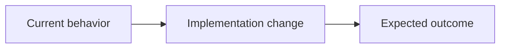

# Devloop Spec

Produce exactly one implementation spec that conforms to the devloop standard. This is the canonical spec skill for devloop.

Use this skill for both cold-start interviews and distilling existing material. Do not hand off to a separate interview or spec-writing skill.

The markdown spec is the source of truth that `devloop` will use as implementation input. If a file is written and the environment supports it, also render the optional HTML companion.

Available resources:

- `references/spec-template.md`: read when drafting or validating the spec shape.
- `scripts/render.py`: run after writing a markdown spec to create a sibling HTML companion.

## Scope Guard

Write exactly one spec sized for one worktree and one PR. Push back before drafting when the request mixes multiple logical changes, depends on an unresolved preparatory refactor, or would plausibly exceed about 300 meaningful changed lines.

When interactive, name the overflow, propose the smallest useful slice, and ask the user to confirm before writing. When non-interactive, spec the first foundational slice and list deferred work in Notes as follow-up specs.

## Source Resolution

Resolve the source material before drafting:

- File path: read it.
- URL: fetch it if the environment allows web access; otherwise record the URL in Notes as a source to verify.
- Pasted text: use it verbatim.
- Current conversation: use only the part clearly about this task; ask for the boundary if the conversation covers unrelated work.
- No source material: use the cold-start interview path.

If a path or URL will not load, say so and stop unless the caller explicitly asks for a best-effort draft.

## Cold Start Interview

Use this mode when there is no document, URL, issue, or concrete context to distill.

- Ask one question at a time.
- Ask why before what.
- Use the host agent's normal user-question mechanism when available; otherwise ask concise plain-text questions.
- Skip obvious questions the repository or prior answers already settle.
- Push vague answers toward observable behavior and acceptance criteria.
- Name contradictions and ask which statement is true.
- Stop only when the spec can be written without TODOs, TBDs, or invented requirements.

Cover these points:

1. The actual problem and when it hurts.
2. The desired observable outcome.
3. Happy path behavior.
4. Edge cases and failure modes.
5. Files, commands, APIs, UI surfaces, or workflows in scope.
6. Explicitly out-of-scope work.
7. Hard constraints, existing conventions, and test expectations.

If the environment cannot ask interactive questions, write a draft with explicit `> **GAP:** ...` markers rather than inventing missing facts.

## Distill Existing Material

Do not fill unsupported sections with plausible detail. Every line must trace to supplied context, repository evidence, or an explicit user answer.

If the spec depends on something cheap to verify, verify it rather than asserting it. Examples: file existence, command names in `package.json` or `pyproject.toml`, API paths in a router, or repo-local test commands.

## Standard

Read `references/spec-template.md` when creating the draft. Every section appears in this order. Frontmatter uses exactly these fields:

```markdown
---
status: draft
type: feat|fix|chore
created: YYYY-MM-DD
pr: null
---

# <Concise title>
<One-sentence subtitle that names the implementation slice and why it matters.>



## Problem
<The real user pain or failure. Include the concrete moment this hurts.>

## Outcome
<The observable end state that means this worked.>

## Scope
- In: <paths, commands, APIs, UI surfaces, or behavior>
- Out: <explicit exclusions>

## Behavior
### Happy path
1. <User/system action>
2. <Expected observable result>

### Edge cases
- <Condition>: <expected result>

## Acceptance criteria
1. <Singular, verifiable requirement with observable evidence.>

## Test plan
- Red: <regression test to add/update first, or why not applicable>
- Green: <targeted command(s)>
- Full: <full test/typecheck/lint command(s)>
- Coverage: <100% coverage command, or why unavailable>

## Constraints
- Must: <hard requirement>
- Avoid: <forbidden approach, dependency, or churn>
- Existing convention: <repo pattern to preserve>

## Notes
<Only material implementation hints, risks, dependencies, migrations, or open questions.>
```

- `created` is today's date.
- Infer `type`: `feat` for new capability, `fix` for broken behavior, and `chore` for maintenance, docs, tests, dependencies, or refactors.
- The H1 is a concise title, not a sentence.
- The subtitle is a plain one-sentence line directly under the H1.
- The Mermaid schematic is optional but preferred when it clarifies architecture, data flow, ownership, or before/after behavior. Omit it if it would be decorative or speculative.
- In Mermaid flowchart node labels, quote labels containing `|`. Use `Node["A | B"]`, not `Node[A | B]`.
- Under `## Behavior`, use `### Happy path` and `### Edge cases` H3 headings, not plain `Happy path:` labels.
- Acceptance criteria must be singular, verifiable, and observable.
- Include concrete paths, commands, APIs, and behaviors when the context provides them.

## Gaps

When required information is still missing, replace that section's placeholder with:

```markdown
> **GAP:** <what is missing and why it matters>
```

Keep every standard section present, remove leftover placeholders, and list the count and names of remaining gaps in Notes.

If interactive and gaps remain, offer to interview for only those gaps after producing the first draft. Do not block delivery of a useful marked draft.

## Output Path

Do not hard-code personal paths. Use this precedence:

1. If devloop or the caller provides a requested output path, write exactly there unless it would overwrite a file and overwrite permission is absent.
2. If devloop or the caller provides a requested output directory, write `YYYY-MM-DD-<slug>.md` there.
3. If the user provides `target=<dir>`, write `<dir>/<slug>.md` for duet/devloop compatibility.
4. If the user requests repo-local output but no path, write `.devloop/specs/YYYY-MM-DD-<slug>.md` under the target repo.
5. Otherwise, write only the markdown spec to stdout.

Do not wrap the spec in a code fence unless the caller explicitly asks for a fenced snippet.

## HTML Companion

When a markdown spec is written to a file, render the interactive HTML companion if the bundled script is available:

```bash
python3 scripts/render.py <path-to-spec.md>
```

Run the command from the skill directory, or resolve `scripts/render.py` relative to this skill's `SKILL.md`. The script writes `<path-to-spec>.html` next to the markdown.

If rendering fails because of Mermaid syntax, fix the markdown source and rerun the renderer. If rendering cannot run in the current environment, keep the markdown spec and say HTML was not generated.

## Signoff

After writing, report the spec path, HTML path if generated, inferred `type`, acceptance criteria, and remaining gaps. Offer `devloop --create-pr <spec path>` as the next handoff when a file path exists.
