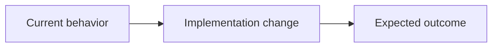

# Devloop Spec

Produce exactly one implementation spec that conforms to the devloop standard. This is the canonical spec skill for devloop.

Use this skill for interviews and for distilling already well-scoped material. Do not hand off to a separate interview or spec-writing skill.

The markdown spec is the source of truth that `devloop` will use as implementation input. If a file is written and the environment supports it, also render the optional HTML companion.

Available resources:

- `references/spec-template.md`: read when drafting or validating the spec shape.
- `scripts/render.sh`: run after writing a markdown spec to create a sibling HTML companion.

## Scope Guard

Write exactly one spec sized for one worktree and one PR. Push back before drafting when the request mixes multiple logical changes, depends on an unresolved preparatory refactor, or would plausibly exceed about 300 meaningful changed lines.

When interactive, name the overflow, propose the smallest useful slice, and ask the user to confirm before writing. When non-interactive and the source is otherwise implementation-ready, spec the first foundational slice and list deferred work in Notes as follow-up specs.

When the work genuinely needs more than one pull request and the slices are already clear, write a stack instead of refusing. See Stack Manifests.

## Stack Manifests

A stack is one manifest plus one child spec per pull request. `devloop <manifest>` runs the children in order, branching each from the previous child's branch and targeting it as the PR base.

Name the manifest `YYYY-MM-DD-<slug>-stack.md` and the children `YYYY-MM-DD-<slug>-01-<child>.md`, continuing in dependency order. Each child is a complete, standard spec that must stand on its own: independently understandable, independently verifiable, and independently revertible.

The manifest needs an H1, a `## Stack` section listing the children in dependency order, and any cross-cutting notes:

````markdown
# <Problem the whole stack solves>

## Stack

1. [<Child problem>](./YYYY-MM-DD-<slug>-01-<child>.md) - branch <branch>, base <base branch>
2. [<Child problem>](./YYYY-MM-DD-<slug>-02-<child>.md) - branch <branch>, base <previous branch>

## Notes

- <why this order, and what each child depends on>
````

Slice by incremental problem resolution, not by architecture label. Do not create a stack when one coherent pull request can carry the change.

## Interview Gate

Before drafting, decide whether the source is implementation-ready. Start or continue an interview when any of these are true:

- No source material was provided.
- The source is a conversation, artifact bundle, notes, or research with multiple plausible implementation slices.
- The problem, outcome, scope, behavior, acceptance criteria, test expectations, or owner repo is missing or contradictory.
- An open question could change the files touched, user-visible behavior, acceptance criteria, spec type, or implementation slice.
- The request is broad or vague, such as "fix this", "improve this", "audit this", or "turn this conversation into a spec" without a clear target outcome.

Do not convert a conversation, artifact bundle, or notes directly into a spec just because there is enough text. Existing material only qualifies for direct distillation when it identifies one worktree-sized change and enough concrete requirements to draft without TODOs, TBDs, GAP markers, or invented detail.

When interactive, ask one question at a time until the gate passes. When the environment cannot ask questions, write a marked draft only if the caller explicitly needs best-effort non-interactive output; otherwise stop with the questions that must be answered.

## Planning Discipline

During spec discovery and interview, do not implement the requested product or code change.

- Discovery before interview: Discover repository facts before user questions. Inspect relevant commands, paths, symbols, ownership boundaries, tests, and local conventions whenever a repository is available.
- Facts vs decisions: Facts are discovered from evidence; decisions are asked of the user. Do not ask the user to restate facts that are cheap to verify.
- User decisions: Ask one user decision at a time and include your recommended answer with the concrete tradeoff.
- Dependency order: Walk parent decisions before downstream details.
- Settled context: If supplied context is already settled, synthesize it directly without re-interviewing.
- Follow-up threshold: Only ask a follow-up when the answer could change scope, behavior, acceptance criteria, failure handling, test seams, or the implementation slice.

## Defect Model

Treat the spec as the shared defect-prevention contract for the implementer and reviewer. Before drafting:

1. Trace the affected behavior from its input or trigger through state changes and external interactions to the observable result.
2. Build a change map naming the repository paths, symbols, ownership boundaries, and existing contracts expected to change or be reused. Separate verified repository facts from proposed design.
3. State the invariants that must remain true across success, failure, retry, and interruption.
4. Enumerate relevant failure modes at every changed boundary and state transition. Check invalid, empty, and boundary inputs; partial failure and interruption; dependency errors and timeouts; retries, duplicates, and idempotency; ordering and concurrency; permissions, security, and privacy; migrations and compatibility; cleanup, rollback, and recovery. Include only credible risks for this change.
5. Identify the highest stable existing test seam. Prefer one seam when practical; if none covers the change, name the smallest appropriate new seam.
6. Map every acceptance criterion, invariant, and failure mode to specific test or observable evidence. Group identifiers when one test proves the same behavior, but leave no obligation without evidence or an explicit reason that verification is manual or unavailable.
7. Name the highest-risk review focus areas and the adjacent ownership boundary the reviewer should inspect for sibling instances of the same bug class.
8. Record every behavior-affecting default, decision, and assumption in Notes. Do not leave the implementer or reviewer to infer a silent choice.

## Source Resolution

Resolve the source material before drafting:

- File path: read it.
- URL: fetch it if the environment allows web access; otherwise record the URL in Notes as a source to verify.
- Pasted text: use it verbatim.
- Current conversation: use only the part clearly about this task; ask for the boundary if the conversation covers unrelated work.
- No source material: use the interview path.

After loading any source, run the Interview Gate. Source presence does not imply direct drafting.

If a path or URL will not load, say so and stop unless the caller explicitly asks for a best-effort draft.

## Interview

Use this mode when there is no document, URL, issue, or concrete context to distill, or when supplied material leaves scope or requirements open.

- Ask one question at a time.
- Ask why before what.
- Use the host agent's normal user-question mechanism when available; otherwise ask concise plain-text questions.
- Skip obvious questions the repository or prior answers already settle.
- Push vague answers toward observable behavior and acceptance criteria.
- Name contradictions and ask which statement is true.
- Stop only when the spec can be written without TODOs, TBDs, GAP markers, or invented requirements.

Cover these points:

1. The actual problem and when it hurts.
2. The desired observable outcome.
3. Happy path behavior.
4. Edge cases and failure modes.
5. Files, commands, APIs, UI surfaces, or workflows in scope.
6. Explicitly out-of-scope work.
7. Hard constraints, existing conventions, and test expectations.

If the environment cannot ask interactive questions and the caller needs best-effort output, write a draft with explicit `> **GAP:** ...` markers rather than inventing missing facts.

## Distill Existing Material

Use this path only after the Interview Gate passes.

Do not fill unsupported sections with plausible detail. Every line must trace to supplied context, repository evidence, or an explicit user answer.

If the spec depends on something cheap to verify, verify it rather than asserting it. Examples: file existence, command names in `package.json` or `pyproject.toml`, API paths in a router, or repo-local test commands.

## Standard

Read `references/spec-template.md` when creating the draft. Every section appears in this order. Frontmatter uses exactly these fields:

````markdown
---
status: draft
type: feat|fix|chore
created: YYYY-MM-DD
pr: null
---

# <Concise title>
<One-sentence subtitle that names the implementation slice and why it matters.>



## Problem
<The real user pain or failure. Include the concrete moment this hurts.>

## Outcome
<The observable end state that means this worked.>

## Scope
- In: <paths, commands, APIs, UI surfaces, or behavior>
- Out: <explicit exclusions>

## Implementation map
1. `<path>` / `<symbol or ownership boundary>`: <intended change, reused contract, and why it belongs here>

## Behavior
### Happy path
1. <User/system action>
2. <Expected observable result>

### Failure and edge cases
- F1 (<condition or failed boundary>): <observable result, recovery behavior, and what must not happen>

## Invariants
- I1: <property that remains true across success, failure, retry, and interruption>

## Acceptance criteria
1. <Singular, verifiable requirement with observable evidence.>

## Test plan
### Proof obligations
- AC1, I1: <test path/name or observable proof>
- F1: <failure injection, regression test, or observable proof>

### Commands
- Red: <regression test to add/update first, or why not applicable>
- Green: <targeted command(s)>
- Full: <full test/typecheck/lint command(s)>
- Coverage: <100% coverage command, or why unavailable>

## Review focus
- <Highest-risk boundary or bug class, why it is risky, and adjacent code to inspect>

## Constraints
- Must: <hard requirement>
- Avoid: <forbidden approach, dependency, or churn>
- Existing convention: <repo pattern to preserve>

## Notes
<Only material defaults, decisions, assumptions, implementation hints, risks, dependencies, migrations, or open questions.>
````

- `created` is today's date.
- Infer `type`: `feat` for new capability, `fix` for broken behavior, and `chore` for maintenance, docs, tests, dependencies, or refactors.
- The H1 is a concise title, not a sentence.
- The subtitle is a plain one-sentence line directly under the H1.
- The Mermaid schematic is optional but preferred when it clarifies architecture, data flow, ownership, or before/after behavior. Omit it if it would be decorative or speculative.
- In Mermaid flowchart node labels, quote labels containing `|`. Use `Node["A | B"]`, not `Node[A | B]`.
- The implementation map names expected ownership boundaries and existing contracts, not incidental line-by-line edits. Every entry must be grounded in repository evidence or clearly labeled as proposed design.
- Under `## Behavior`, use `### Happy path` and `### Failure and edge cases` H3 headings, not plain labels.
- Number failure modes with plain labels such as `F1` and invariants with plain labels such as `I1`. Acceptance criteria are numbered positionally by their list order; refer to them as `AC1`, `AC2`, and so on in the proof map, but do not write an `AC` label inside criterion text.
- Acceptance criteria must be singular, verifiable, and observable. Do not restate implementation steps as acceptance criteria.
- The test-plan proof map must cover every `AC`, `I`, and `F` identifier exactly once or explain why its evidence is manual or unavailable. Combine identifiers when one proof covers them without merely restating the requirements.
- Keep Review focus to the one to three highest-risk boundaries or bug classes. It guides adversarial review but does not limit the reviewer's engineering-quality pass.
- Record material defaults, decisions, assumptions, dependencies, and risks in Notes. Omit empty categories.
- Include concrete paths, commands, APIs, and behaviors when the context provides them.

## Gaps

When required information is still missing and the caller explicitly needs a best-effort non-interactive draft, replace that section's placeholder with:

```markdown
> **GAP:** <what is missing and why it matters>
```

Keep every standard section present, remove leftover placeholders, and list the count and names of remaining gaps in Notes.

If interactive and gaps remain, do not draft yet. Ask the next interview question instead.

## Output Path

Do not hard-code personal paths. Use this precedence:

1. If devloop or the caller provides a requested output path, write exactly there unless it would overwrite a file and overwrite permission is absent.
2. If devloop or the caller provides a requested output directory or spec directory, write `YYYY-MM-DD-<slug>.md` there.
3. If the user provides `target=<dir>`, write `<dir>/<slug>.md` for duet/devloop compatibility.
4. If a target repo can be resolved from the current working directory, an explicit target repo, or a source file path, write `<repo>/.devloop/specs/YYYY-MM-DD-<slug>.md` and create the directory if needed.
5. Otherwise, write only the markdown spec to stdout.

Do not wrap the spec in a code fence unless the caller explicitly asks for a fenced snippet.

## HTML Companion

When a markdown spec is written to a file, render the interactive HTML companion if the bundled script is available:

```bash
scripts/render.sh <path-to-spec.md>
```

Run the command from the skill directory, or resolve `scripts/render.sh` relative to this skill's `SKILL.md`. The script writes `<path-to-spec>.html` next to the markdown.

If Mermaid fails in the browser, fix the markdown source and rerun the renderer. If rendering cannot run in the current environment, keep the markdown spec and say HTML was not generated.

## Signoff

After writing, report the spec path, HTML path if generated, inferred `type`, acceptance criteria, and remaining gaps. Offer `devloop --create-pr <spec path>` as the next handoff when a file path exists.
