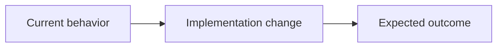

# <Concise title>
<One-sentence subtitle that names the implementation slice and why it matters.>

## Problem
<The real user pain or failure. Include the concrete moment this hurts.>

## Outcome
<The observable end state that means this worked.>

## Scope
- In: <paths, commands, APIs, UI surfaces, or behavior>
- Out: <explicit exclusions>

## Implementation map
1. `<path>` / `<symbol or ownership boundary>`: <intended change, reused contract, and why it belongs here>

## Behavior
### Happy path
1. <User/system action>
2. <Expected observable result>

### Failure and edge cases
- F1 (<condition or failed boundary>): <observable result, recovery behavior, and what must not happen>
- F2 (<condition or failed boundary>): <observable result, recovery behavior, and what must not happen>

## Invariants
- I1: <property that remains true across success, failure, retry, and interruption>
- I2: <property that remains true across success, failure, retry, and interruption>

## Acceptance criteria
1. <Singular, verifiable requirement with observable evidence.>
2. <Singular, verifiable requirement with observable evidence.>

## Test plan
### Proof obligations
- AC1, I1, F1: <test path/name, failure injection, or observable proof>
- AC2, I2, F2: <test path/name, failure injection, or observable proof>

### Commands
- Red: <regression test to add/update first, or why not applicable>
- Green: <targeted command(s)>
- Full: <full test/typecheck/lint command(s)>
- Coverage: <100% coverage command, or why unavailable>

## Review focus
- <Highest-risk boundary or bug class, why it is risky, and adjacent code to inspect>

## Constraints
- Must: <hard requirement>
- Avoid: <forbidden approach, dependency, or churn>
- Existing convention: <repo pattern to preserve>

## Notes
<Only material defaults, decisions, assumptions, implementation hints, risks, dependencies, migrations, or open questions.>
